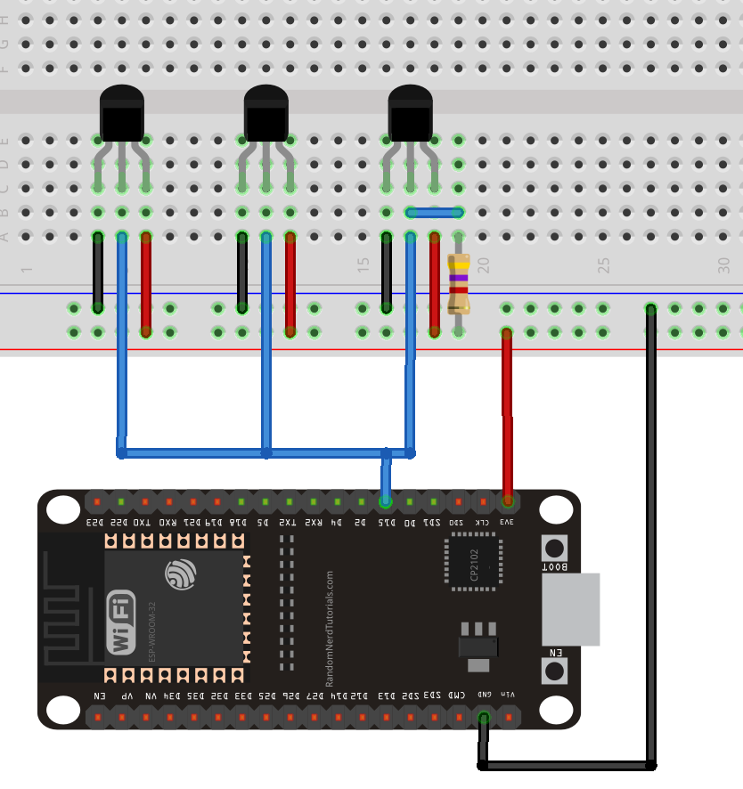

# Temperatur-Sensor Array

## DS18B20

Der Sensor ist recht genügsam, was die Spannung angeht.
Er gibt sich mit irgendwas zwischen 3.0 V und 5.5 V zufrieden.

AFAIK kann nur jede 1 Sekunde ein Wert ausgelesen werden.

## Verschaltung mehrerer DS18B20

Es ist recht einfach, nahezu beliebig viele DS18B20 an einen Pin zu schalten.
Alle Sensoren werden an GND und VCC angeschlossen.
Der Data-Pin wird ebenfalls gemeinsam an einen digitalen Input-Pin angeschlossen und mit einem Pull-Up-Widerstand (4.7kOhm) auf VCC hochgezogen.

In diesem Bild zeigt die runde Seite nach hinten.

Wenn man den DS18B20 von der flachen Seite betrachtet, sind die Pins:

1. GND
2. Data
3. VCC

## Leitungen anlöten

Es gibt zwar viele 3-adrige Kabel; aber das sind meistens Stromkabel - und entsprechend dick und teuer.
Für dieses Projekt eignet sich dies hier: <https://smile.amazon.de/CARLITS-Drahtseilleitung-Verseiltes-Verzinntes-3x0-3mm%C2%B2/dp/B08J7WKV6W>
Die Farben nebeneinander sind:

1. weiß
2. grün
3. rot

VCC sollte rot sein - der Konvention halber.
Schwarz für GND haben wir hier nicht; aber ein halbwegs dunkles grün.
Für Data wird gerne weiß oder gelb verwendet.
Damit hätten wir bei diesem Kabel immerhin eine Farbkodierung, die nicht vollkommen verwirrend ist.
Allerdings überkreuzen sich dann (2) grün und (1) weiß, da das beim Sensor anders angeordnet ist:

```
GND  --\/-- weiß
Data --/\-- grün
VCC  ------ rot
```

## Konnektivität prüfen

Bevor mehr mit dem Aufbau gemacht wird, sollte geprüft werden ob alle Sensoren funktionieren und sinnvolle Werte liefern.

Mit folgendem Code einfach alle Sensoren automatisch nacheinander auslesen.
Sie sollten alle a) überhaupt Werte liefern und b) in etwa die gleichen Werte liefern.

Jeden Sensor zwischen zwei Finger nehmen und schauen welcher höhere Werte liefert.
Die Adresse nun irgendwie am Sensor zu notieren könnte sinnvoll sein.

## Proof of Concept

An alle Sensoren 3-adriges Kabel anlöten.
Alle gleichen Leitungen in jeweils eine Lüsterklemme schrauben; die andere Seite an den Microcontroller anschließen.

Allerdings sind Lüsterklemmen bei den vielen kleinen Drähten in den Kabeln meist gar nicht so toll.

## Aufbau

Am Ende ist sowieso alles an einer (bzw. halt drei) Leitungen - darüber muss man sich immerhin keine Gedanken machen.

Die primäre Idee ist, ganz viele Sensoren an einen Heizkörper zu kleben - hauptsächlich for fun und um zu sehen, wie sich die Hitze so ausbreitet.
Das simpelsten und ästhetischste ist, wenn der Heizkörper als Quader mit jeweils 3 "Slices" betrachtet wird und auf jeder Ebene 9 Sensoren sind; insgesamt also 3*3*3=27 Sensoren.
So bekommt man dann ein mittelmäßig gut aufgelöstes Bild vom Heizkörper über die Zeit.

Wenn man zu allen Sensoren eine eigene Leitung legt, verbraucht man relativ schnell recht viel Kabel.
Der Heizkörper ist 80x20x60cm (BxTxH) groß und 20cm über dem Boden (wo der Microcontroller wohl liegt).
Grob zusammengerechnet ergibt das (Tiefe ignoriert; Diagonalen aber auch):

- 3\*(60\*2/2 + 80\*2/2 + 20) = 480cm
- 3\*(60\*1/2 + 80\*2/2 + 20) = 390cm
- 3\*(60\*0/2 + 80\*2/2 + 20) = 300cm

- 3\*(60\*2/2 + 80\*1/2 + 20) = 360cm
- 3\*(60\*1/2 + 80\*1/2 + 20) = 270cm
- 3\*(60\*0/2 + 80\*1/2 + 20) = 180cm

- 3\*(60\*2/2 + 80\*0/2 + 20) = 240cm
- 3\*(60\*1/2 + 80\*0/2 + 20) = 150cm
- 3\*(60\*0/2 + 80\*0/2 + 20) = 60cm

Insgesamt also 2430cm bzw 24m.

Das lässt sich aber vermutlich ganz gut reduzieren, indem man Leitungen recht frühzeitig mit Lüsternklemmen zusammenführt:

- 3\*20 + 60\*2/2 + 80\*2/2 + 20 = 220cm
- 3\*20 + 60\*1/2 + 80\*2/2 + 20 = 190cm
- 3\*20 + 60\*0/2 + 80\*2/2 + 20 = 160cm

- 3\*20 + 60\*2/2 + 80\*1/2 + 20 = 180cm
- 3\*20 + 60\*1/2 + 80\*1/2 + 20 = 150cm
- 3\*20 + 60\*0/2 + 80\*1/2 + 20 = 120cm

- 3\*20 + 60\*2/2 + 80\*0/2 + 20 = 140cm
- 3\*20 + 60\*1/2 + 80\*0/2 + 20 = 110cm
- 3\*20 + 60\*0/2 + 80\*0/2 + 20 = 80cm

Insgesamt also schonmal nur noch 1350cm bzw 13m.
Das braucht dann 9\*3=27 Lüsternklemmen.

Das kann man nochmal etwas reduzieren; braucht halt für jeden "Knotenpunkt" 3 Lüsternklemmen.
Wenn man in der Höhe abwärts geht, kann man immerhin die Lüsternklemme der nächst unteren Ebene benutzen.
In der Breite kann man das gleiche machen; es braucht also gar keine zusätzlichen Lüsternklemmen.
Beim Abmessen des Kabels sollte man wohl dennoch genug Länge zusätzlich dazugeben.

## Recording

MTTQ? SD-Karte? HomeAssistant?

## Auswertung

Vielleicht kann man das mit R irgendwie hübsch visualisieren.
